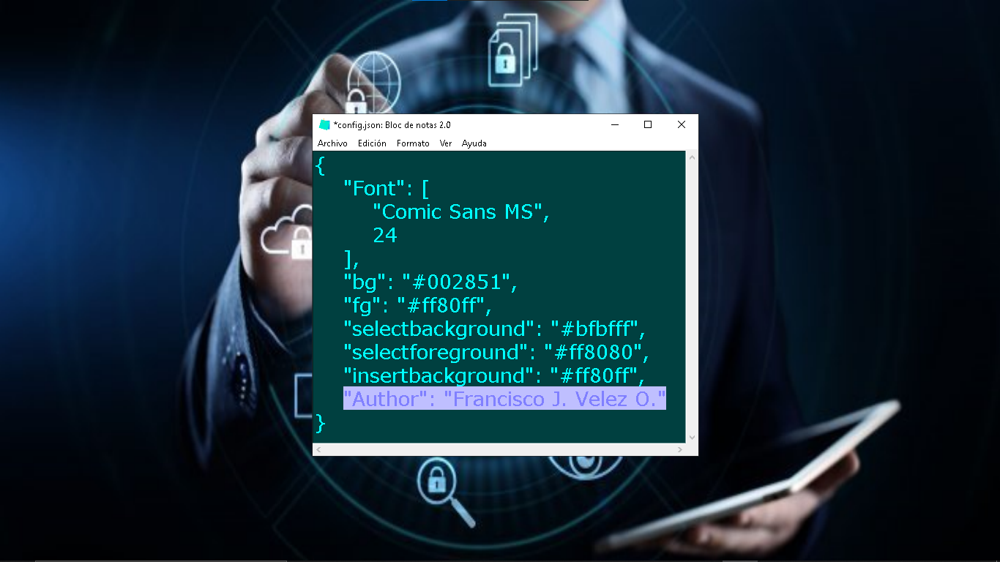

# Python-Tkinter-Notepad
Project #2 with Python - Tkinter. A more customizable copy of the
windows notepad.

Main file to execute is __main__.py, when executing this
file opens the notepad, in the menu there are functions that come
from original windows notepad other functions are added
for a better experience and customization.

**Image**

**Best regard !!!**

<cite>Author: Francisco Vélez</cite>
